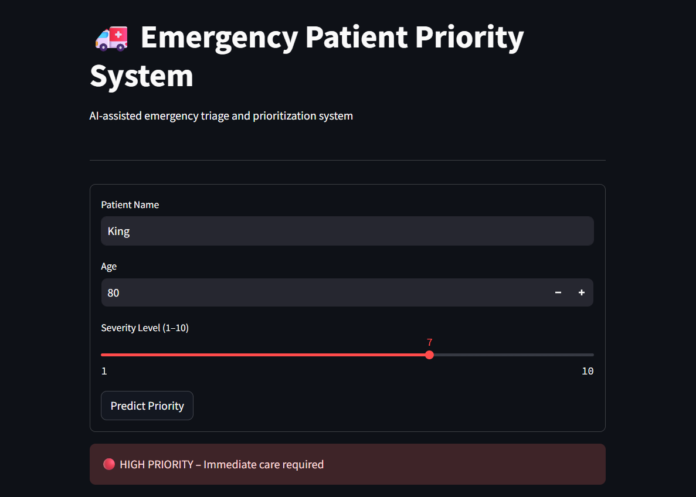
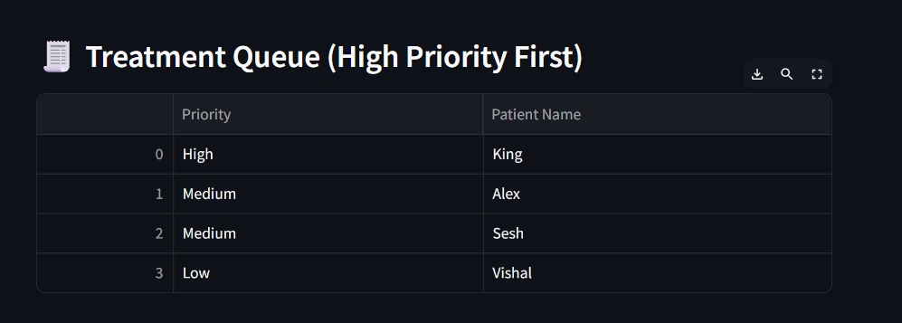
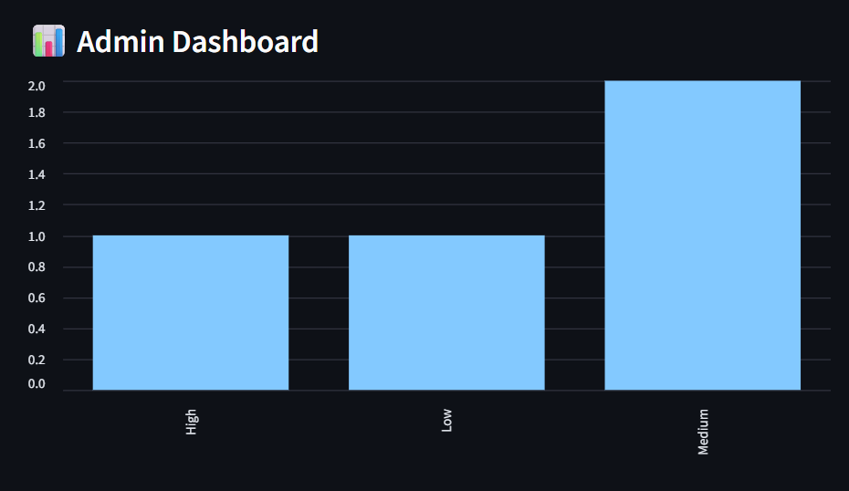

# 🚑 Emergency Patient Priority System 🏥

## 📋 Project Overview

The Emergency Patient Priority System is an interactive emergency triage and patient prioritization application developed using Python and Streamlit.

The application helps organize emergency cases based on the patient's age and reported severity level. It assigns each patient a priority category and places them into a treatment queue so that higher-priority cases can be displayed first.

The system provides:

- ⚡ Automated priority prediction
- 🚑 Emergency patient prioritization
- 📊 Priority distribution dashboard
- 🧾 Treatment queue management
- 🖥️ Interactive Streamlit interface
- 🧠 Heap-based priority queue implementation

The project demonstrates the practical application of Python, Data Structures and Algorithms, and Streamlit in an emergency healthcare-oriented system.

---

## 💻 Requirements

The project uses the following Python libraries:

1. Streamlit
2. Pandas
3. NumPy

The project also uses Python's built-in `heapq` module for implementing the emergency priority queue.

---

## 🛠️ Technologies Used

- Python
- Streamlit
- Pandas
- NumPy
- Heap Queue (`heapq`)
- Data Structures and Algorithms

---

## 📥 Installation

To run the project locally, follow these steps:

### 1. Clone the repository

```bash
git clone https://github.com/Shivapriyamuthyala/Emergency-Priority-App.git
cd Emergency-Priority-App
```

### 2. Create a virtual environment

```bash
python -m venv venv
```

### 3. Activate the virtual environment

For Windows:

```bash
venv\Scripts\activate
```

For Linux/Mac:

```bash
source venv/bin/activate
```

### 4. Install the required libraries

```bash
pip install -r requirements.txt
```

### 5. Run the application

```bash
streamlit run app.py
```

After running the command, open the local URL provided by Streamlit in your web browser.

---

## 🚀 Usage

After running the application, the Emergency Patient Priority System will open in your browser.

Enter the following patient details:

1. **Patient Name**
2. **Age** — between 0 and 120
3. **Severity Level** — between 1 and 10

Click the **🔮 Predict Priority** button to generate the patient's priority level.

---

## 🎯 Priority Prediction

The system classifies patients into three priority categories based on age and severity level.

| Priority | Condition | Status |
|---|---|---|
| 🔴 High | Severity ≥ 8 OR Age ≥ 70 | Immediate care required |
| 🟡 Medium | Severity ≥ 4 | Needs attention soon |
| 🟢 Low | Severity < 4 | Stable condition |

### Priority Output

**High Priority**

```text
🔴 HIGH PRIORITY – Immediate care required
```

**Medium Priority**

```text
🟡 MEDIUM PRIORITY – Needs attention soon
```

**Low Priority**

```text
🟢 LOW PRIORITY – Stable condition
```

---

## 🔄 Application Workflow

```text
Patient Information
        ↓
Age + Severity Level
        ↓
Priority Prediction
        ↓
High / Medium / Low
        ↓
Emergency Priority Queue
        ↓
Treatment Queue
        ↓
Admin Dashboard
```

---

## 🧠 Emergency Priority Queue

The application uses Python's built-in **heapq** module to implement an emergency priority queue.

Patients are organized according to their assigned priority level so that higher-priority cases can be displayed first.

| Priority Value | Category | Action |
|---|---|---|
| 2 | 🔴 High | Immediate care required |
| 1 | 🟡 Medium | Needs attention soon |
| 0 | 🟢 Low | Stable condition |

---

## 📊 Admin Dashboard

The Admin Dashboard provides a visual summary of the patients currently in the treatment queue.

It displays:

- Number of Low Priority patients
- Number of Medium Priority patients
- Number of High Priority patients
- Priority distribution bar chart

---

## 🧾 Treatment Queue

The treatment queue displays patients according to their priority category.

```text
🔴 High Priority
        ↓
🟡 Medium Priority
        ↓
🟢 Low Priority
```

---

## 📂 Project Structure

```text
Emergency-Priority-App/
│
├── app.py
├── model.py
├── dsa.py
├── requirements.txt
├── README.md
├── .gitignore
│
├── data/
│   └── data.csv
│
└── screenshots/
    ├── app_interface.png
    ├── priority-output.png
    └── admin-dashboard.png
```

---

## 📁 Project Files

### `app.py`

Contains the Streamlit user interface and application logic for entering patient information, predicting priority, displaying the treatment queue, and showing the admin dashboard.

### `model.py`

Contains the priority prediction logic that classifies patients into High, Medium, or Low priority based on age and severity level.

### `dsa.py`

Implements the emergency priority queue using Python's `heapq` data structure.

### `requirements.txt`

Contains the Python libraries required to run the application.

### `data/data.csv`

Contains the project data file included in the project structure.

---

## 📈 Output

For example:

```text
Patient Name: John
Age: 75
Severity Level: 6

🔴 HIGH PRIORITY
Immediate care required
```

---

## 📸 Application Interface



---

## 📸 Priority Prediction Output



---

## 📊 Admin Dashboard



---

## 🎯 Project Objectives

- Develop an interactive emergency patient prioritization system
- Automate emergency priority classification
- Apply Data Structures and Algorithms to queue management
- Organize patients according to priority
- Visualize priority distribution
- Develop a user-friendly Streamlit healthcare-oriented application

---

## 🔮 Future Enhancements

- Integration with a real-time hospital database
- Addition of more clinical parameters
- Machine learning-based priority prediction
- Patient medical history integration
- Real-time queue updates
- Staff authentication and role-based access
- Cloud deployment

---

## ⚠️ Disclaimer

This project is developed for **educational and demonstration purposes only**.

It is not intended to replace professional medical judgment, clinical assessment, or emergency medical services.

---

## 👩‍💻 Author

**Muthyala Shiva Priya**

GitHub: https://github.com/Shivapriyamuthyala

---

## ⭐ Acknowledgement

This project demonstrates the practical use of **Python, Streamlit, Data Structures and Algorithms** for developing an emergency patient prioritization application.